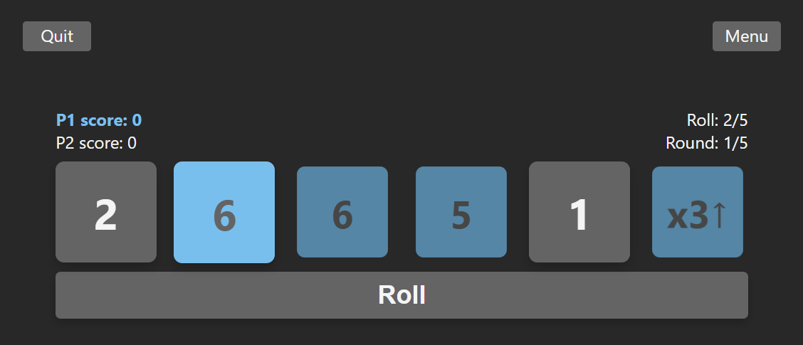

# Hi-Lo

An addictive dice game for two players. The goal is to collect either the highest OR the lowest dice you can over 5 rounds.

## Tenchnologies Used

- React
- CSS
- Firebase

## Features

- Navigation system including welcome, menu and gameplay screens
- Two players
- Play against the computer

## How To Play

1.  You are given five rolls per turn. Tap on a die to lock it
2.  The number of dice locked must be equal to or greater than the
    roll you're on. So if it's roll #2, you need to have at least 2 dice locked
    to continue
3.  For the most points, you want the highest OR the lowest rolls
    possible. You decide!

4.  The ↑↓ die is special. You want "↑" if you're going for high
    rolls, or "↓" if you're going for low rolls. The number on this die
    multiplies your points, so you want 3x whenever possible!

5.  A perfect score is all 6s and x3↑ OR all 1s and x3↓

6.  The player with the highest score after 5 rounds wins!

##

**See more detailed rules and scoring information in the app**
